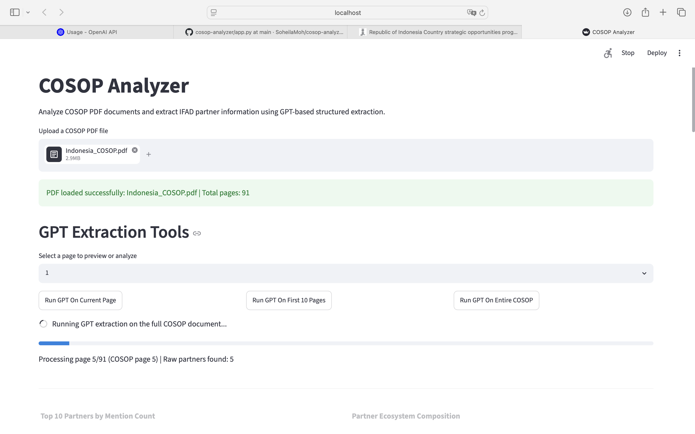
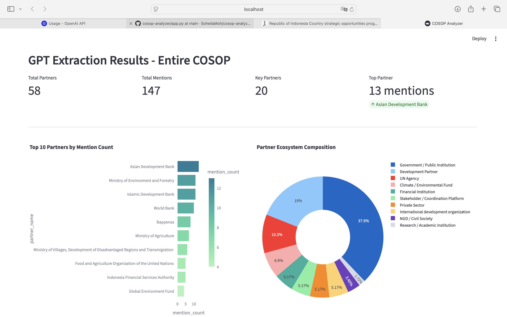
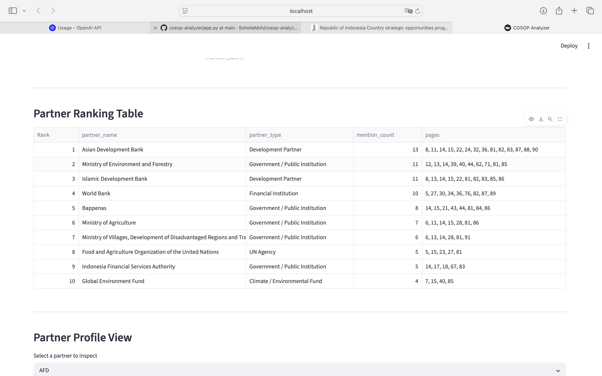
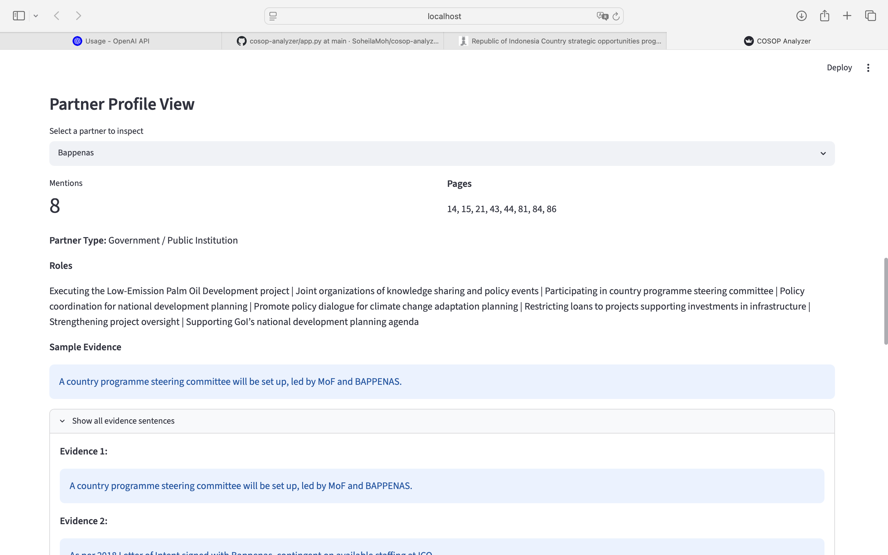
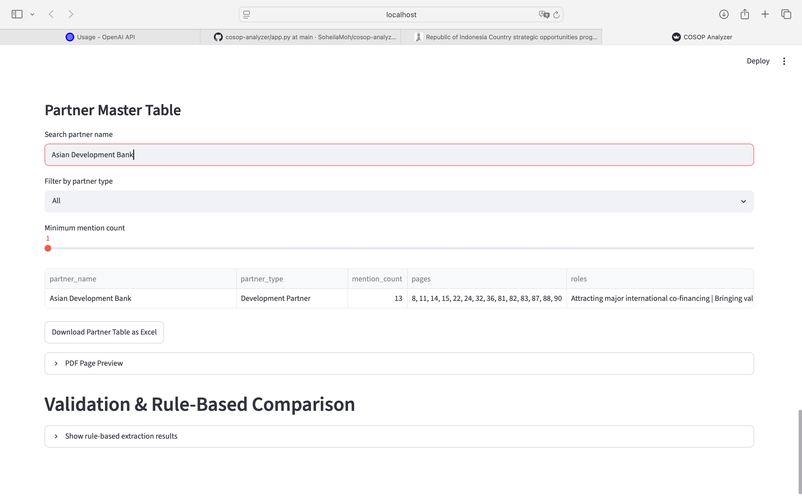
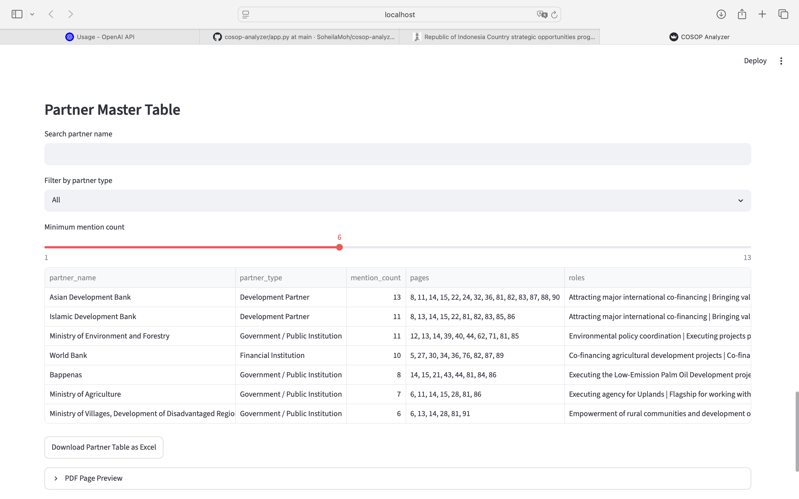
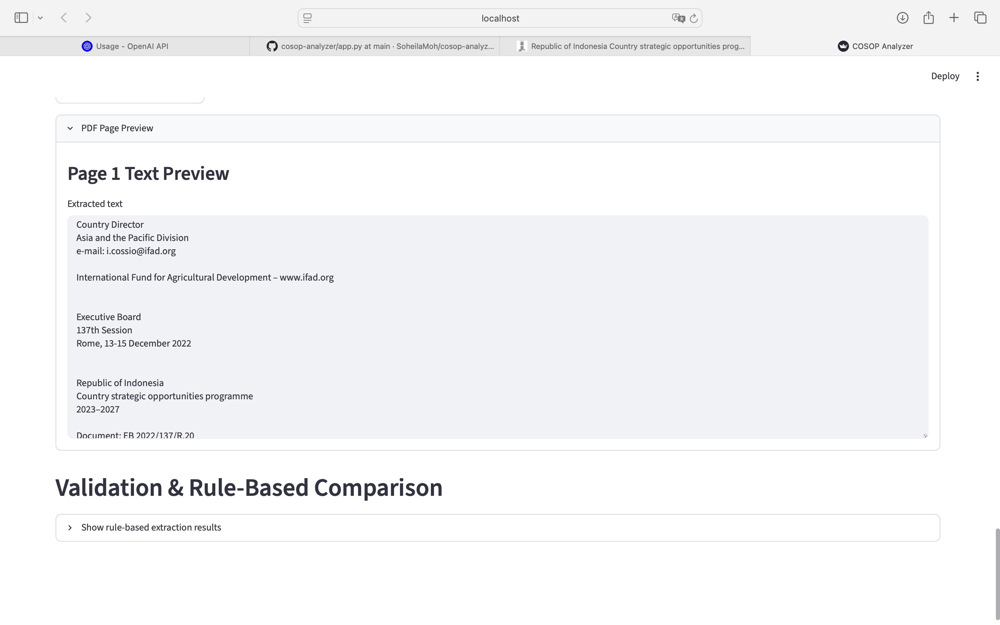
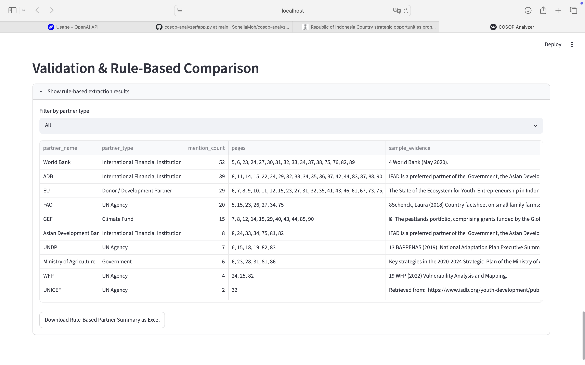

# COSOP Analyzer

COSOP Analyzer is an AI-powered interactive dashboard for extracting, validating, categorizing, and analyzing IFAD partner information from COSOP PDF documents.

This prototype was developed for the AI at IFAD Technical Challenge – Option B: COSOP-Analyzer Interactive Data Dashboard.

## Overview
The application allows users to upload a text-based COSOP PDF document and extract structured information about organizations mentioned as IFAD partners. The extracted partner information is cleaned, validated, deduplicated, visualized, and made available for download as an Excel file.

The prototype has been tested using both the Cambodia COSOP 2022–2027 and the Indonesia COSOP documents. Partner entities are normalized and validated through a rule-based validation layer to improve consistency across different country strategies.

## Main Features

- Upload and process COSOP PDF files
- Extract text from PDF pages
- Use an LLM to identify IFAD partner organizations
- Categorize partners by type
- Remove irrelevant entities such as individuals, countries, generic stakeholder groups, and programme names
- Normalize organization names and partner types
- Deduplicate repeated partner mentions
- Display partner analytics in an interactive Streamlit dashboard
- Search and filter extracted partners
- View detailed partner profiles with roles, pages, and evidence sentences
- Export extracted partner data to Excel
- Cache extraction results to avoid repeated LLM calls

## Screenshots

### Upload and Extraction Workflow


### Dashboard Analytics


### Partner Ranking Table


### Partner Profile Explorer


### Search and Export Features


### Advanced Filtering


### PDF Preview


### Validation Comparison



## Dashboard Components

The dashboard includes:

- KPI cards
- Top partners by mention count
- Partner ecosystem composition chart
- Partner ranking table
- Partner profile view
- Searchable and filterable master partner table
- Excel export
- Rule-based validation comparison output

## Project Structure

## Project Structure

```text
Cosop_Analyzer
│
├── app.py
├── requirements.txt
├── README.md
├── .env.example
│
├── data
│   └── Cambodia_COSOP.pdf
│
├── outputs
│   └── full_gpt_partner_table.xlsx
│
└── src
    ├── pdf_processor.py
    ├── partner_finder.py
    ├── llm_extractor.py
    └── validator.py
```

## How It Works

1. The user uploads a COSOP PDF document.
2. The PDF text is extracted page by page.
3. The LLM processes the text and extracts structured partner information.
4. The validator removes invalid or generic entities.
5. Partner names and partner types are normalized.
6. Duplicate partner records are merged.
7. The dashboard visualizes the extracted partner ecosystem.
8. The final partner table can be exported to Excel.

## Installation

Clone the repository:

bash git clone <your-repository-url> cd Cosop_Analyzer 

Create and activate a virtual environment:

bash python -m venv .venv source .venv/bin/activate 

Install dependencies:

bash pip install -r requirements.txt 

## Environment Variables

Create a .env file based on .env.example.

Example:

bash OPENAI_API_KEY=your_api_key_here 

Do not commit real API keys or secrets to GitHub.

## Running the App

Run the Streamlit application:

bash streamlit run app.py 

Then open the local URL shown in the terminal.

## Notes and Assumptions

- The prototype assumes that uploaded PDFs are text-based and not scanned images.
- The extraction logic was primarily tested on the Cambodia COSOP.
- The validation layer is configurable and can be adapted for other COSOP documents by updating normalization and exclusion dictionaries.
- For new countries, additional country-specific acronyms, ministries, institutions, and programme names may need to be added to the validator.

## Limitations

- The prototype does not perform OCR on scanned PDFs.
- Partner relationship network analysis is not included in this version.
- Extraction quality depends on the quality of the PDF text and the LLM response.
- Validation rules were tuned using two main COSOP sample and may require adjustment for other countries.

## Technical Stack

- Python
- Streamlit
- Pandas
- Plotly
- OpenPyXL
- LLM API-based extraction
- PDF text extraction

## Deliverables

This repository includes:

- Source code
- Modular data processing and validation logic
- Interactive Streamlit dashboard
- Excel export functionality
- Environment variable template
- README instructions